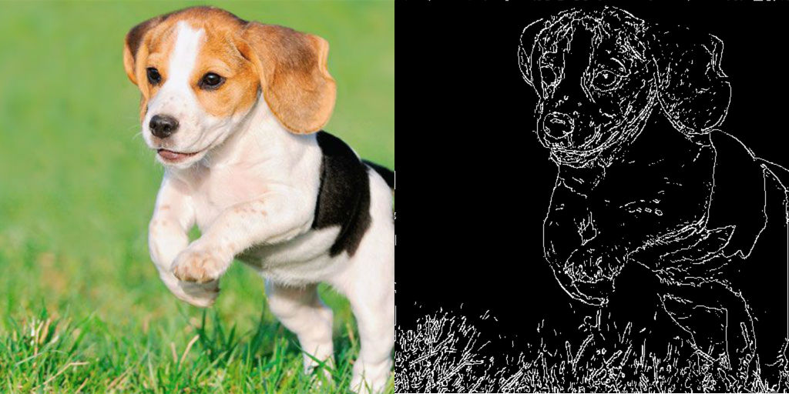
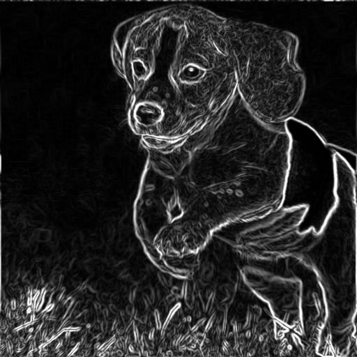

!

# glsl-canny-edge-detection
GLSL Canny edge detection for WebGL textures

## License
This software is distributed under an MIT license.
See LICENSE.md for more information.

---

[Live demo](https://dcthetall-edge-detection.herokuapp.com/)

### Example Usage

```
#pragma glslify: cannyEdgeDetection = require(glsl-canny-edge-detection);

uniform sampler2D uSampler;
uniform vec2 uResolution;
uniform float uWeakThreshold;
uniform float uStrongThreshold;

varying vec2 vTextureCoord;

void main() {
  // returns 1. if it is an edge, 0. otherwise
  float edge = cannyEdgeDetection(
    uSampler, vTextureCoord, uResolution, uWeakThreshold, uStrongThreshold);
  gl_FragColor = vec4(vec3(edge), 1.);
}
```

It also contains a module which will apply a 3x3 Sobel operator to a
texture. For example:

```
#pragma glslify: gradient = require(glsl-canny-edge-detection/lib/intensity-gradient);

uniform sampler2D uSampler;
uniform vec2 uResolution;

varying vec2 vTextureCoord;

void main() {
  // returns 1. if it is an edge, 0. otherwise
  vec2 grad = gradient(
    uSampler, vTextureCoord, uResolution);
  gl_FragColor = vec4(length(grad), 1.);
}
```

Applying this to the texture above will result in



---
### Algorithm
This program uses Canny edge detection on images and video in real time.
The algorithm is broken into the following steps:

1. Apply a 5-pixel Gaussian blur to the image. This program uses the open source library
[glsl-fast-gaussian-blur](https://github.com/Jam3/glsl-fast-gaussian-blur).

2. Calculate the texture intensity gradient using a 3x3 Sobel operator.

3. Round the gradient to 1 of the 8 cardinal directions.
This is done by seeing which direction has the highest
dot product with the gradient vector.

4. Suppress any gradient that is not a local maximum in
the direction the vector points.

5. Apply a double threshold to the gradient vector to classify
each pixel as not an edge, a weak edge, or a strong edge.

6. Apply hysteresis to the existing weak edges. If a weak
edge does not neighbor a strong edge, then it is likely
due to noise, so we consider it to not be an edge. If a weak
edge does neighbor a strong edge, then consider it a strong
edge as well.
